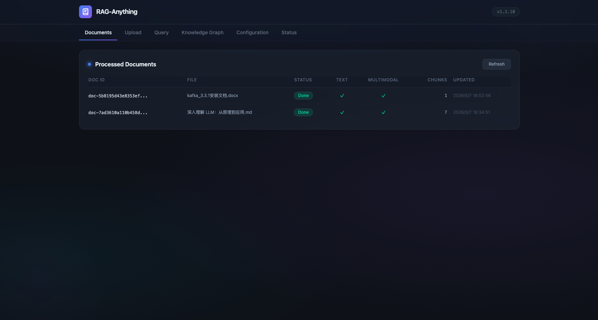
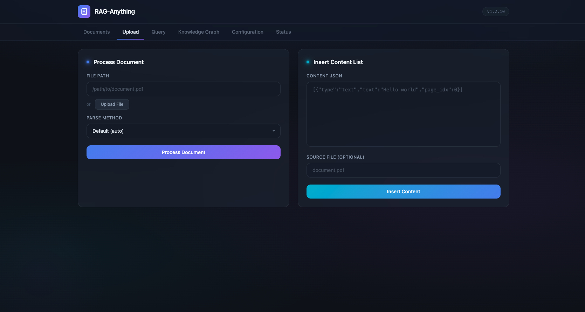
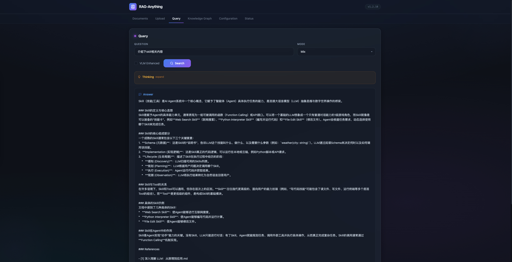
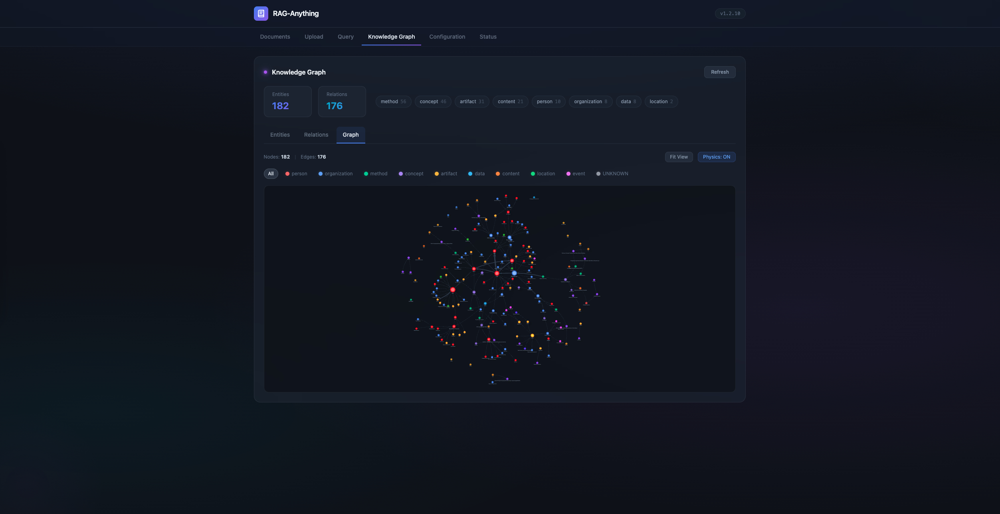
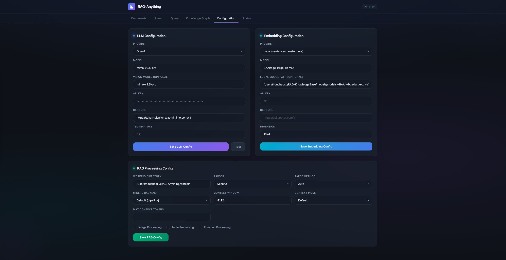
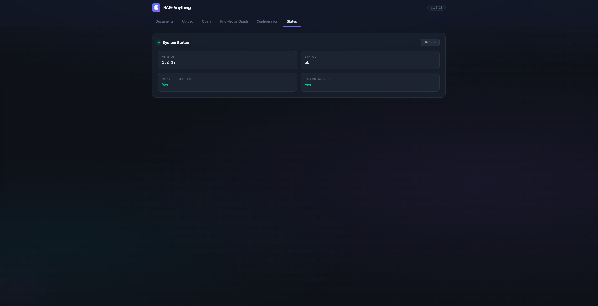

# RAG-Web

[RAG-Anything](https://github.com/HKUDS/RAG-Anything) 的 RESTful API 和 Web UI，将原始 Python 库转变为一个完整的 Web 服务，支持多模态文档处理、知识图谱可视化和交互式查询。

## 功能特性

- **RESTful API** — 基于 FastAPI 的服务，提供文档、查询、配置和知识图谱的完整 CRUD 接口
- **Web 前端** — 单页应用，支持上传文档、查询知识库和探索图谱
- **多模型提供商** — 支持 OpenAI、Ollama、Azure OpenAI、LM Studio、vLLM
- **本地嵌入** — 通过 sentence-transformers（BGE、E5、GTE 等）在本地运行嵌入模型，无需外部 API 调用
- **热重载配置** — 通过 API 运行时更新 LLM、嵌入和 RAG 设置，无需重启
- **异步文档处理** — 后台任务处理，实时阶段跟踪（解析 → 文本提取 → 多模态 → 完成）
- **知识图谱浏览器** — 浏览实体、关系，并以交互式网络图形式可视化图谱
- **多模态查询** — 在单次请求中使用文本、图像、表格和公式进行查询

## 界面截图

| 文档管理 | 文档上传 |
|----------|----------|
|  |  |

| 智能查询 | 知识图谱 |
|----------|----------|
|  |  |

| 配置管理 | 系统状态 |
|----------|----------|
|  |  |

## 快速开始

### 安装

```bash
pip install -e .
pip install fastapi uvicorn[standard] python-multipart
```

### 启动服务

```bash
python -m raganything.api.server --port 8000
```

启动参数：
- `--host` — 绑定地址（默认：`0.0.0.0`）
- `--port` — 端口（默认：`8000`）
- `--reload` — 代码变更时自动重载（开发模式）

打开 http://localhost:8000 访问 Web UI，或打开 http://localhost:8000/docs 访问交互式 API 文档（Swagger）。

## API 接口

### 健康检查

| 方法 | 路径 | 说明 |
|------|------|------|
| GET | `/api/health` | 服务健康状态、版本、解析器安装检查 |

### 配置管理

| 方法 | 路径 | 说明 |
|------|------|------|
| GET | `/api/config/llm` | 获取当前 LLM 配置 |
| PUT | `/api/config/llm` | 更新 LLM 配置（提供商、模型、API Key、温度等） |
| GET | `/api/config/embedding` | 获取当前嵌入模型配置 |
| PUT | `/api/config/embedding` | 更新嵌入配置（提供商、模型、维度等） |
| GET | `/api/config/rag` | 获取 RAG 设置（工作目录、解析器、上下文模式） |
| PUT | `/api/config/rag` | 更新 RAG 设置 |
| GET | `/api/config/full` | 获取完整配置 |
| PUT | `/api/config/full` | 一次性更新完整配置 |
| POST | `/api/config/test-llm` | 使用简单提示词测试 LLM 连通性 |

### 文档处理

| 方法 | 路径 | 说明 |
|------|------|------|
| POST | `/api/documents/upload` | 上传文件（返回 task_id） |
| POST | `/api/documents/process` | 按文件路径处理文档（异步，返回 task_id） |
| GET | `/api/documents/tasks/{task_id}` | 轮询任务状态和处理阶段 |

### 批量处理

| 方法 | 路径 | 说明 |
|------|------|------|
| POST | `/api/batch/process` | 按文件路径批量处理多个文档 |
| POST | `/api/batch/process-folder` | 处理指定文件夹中所有支持的文件 |

### 查询

| 方法 | 路径 | 说明 |
|------|------|------|
| POST | `/api/query` | 对知识库进行文本查询 |
| POST | `/api/query/multimodal` | 使用多模态内容查询（图像、表格、公式） |
| POST | `/api/query/stream` | 流式查询响应（SSE） |

查询模式：`local`、`global`、`hybrid`、`naive`、`mix`、`bypass`

### 知识图谱

| 方法 | 路径 | 说明 |
|------|------|------|
| GET | `/api/graph/stats` | 实体/关系数量和类型分布 |
| GET | `/api/graph/entities` | 列出实体（支持搜索和分页） |
| GET | `/api/graph/relations` | 列出关系（支持搜索和分页） |
| GET | `/api/graph/network` | 获取 vis-network 格式的完整图数据用于可视化 |

## 配置示例

### LLM（OpenAI）

```json
PUT /api/config/llm
{
  "provider": "openai",
  "model": "gpt-4o",
  "api_key": "sk-...",
  "temperature": 0.7
}
```

### LLM（Ollama 本地）

```json
PUT /api/config/llm
{
  "provider": "ollama",
  "model": "qwen2.5:7b",
  "base_url": "http://localhost:11434"
}
```

### 嵌入模型（本地 sentence-transformers）

```json
PUT /api/config/embedding
{
  "provider": "local",
  "model": "BAAI/bge-large-zh-v1.5",
  "dimension": 1024,
  "batch_size": 64
}
```

### 嵌入模型（OpenAI）

```json
PUT /api/config/embedding
{
  "provider": "openai",
  "model": "text-embedding-3-large",
  "api_key": "sk-...",
  "dimension": 3072
}
```

## 项目结构

```
raganything/api/
├── app.py                  # FastAPI 应用工厂
├── server.py               # CLI 入口（uvicorn）
├── schemas.py              # Pydantic 请求/响应模型
├── routers/
│   ├── health.py           # 健康检查接口
│   ├── config.py           # 配置 CRUD 接口
│   ├── documents.py        # 文档上传与处理
│   ├── query.py            # 文本与多模态查询
│   ├── batch.py            # 批量文档处理
│   └── graph.py            # 知识图谱接口
├── services/
│   ├── rag_service.py      # RAG 生命周期管理（单例）
│   └── llm_factory.py      # 多模型提供商工厂
└── static/
    └── index.html          # Web 前端（单页应用）
```

## 许可证

本项目基于 [RAG-Anything](https://github.com/HKUDS/RAG-Anything)（HKUDS）。
